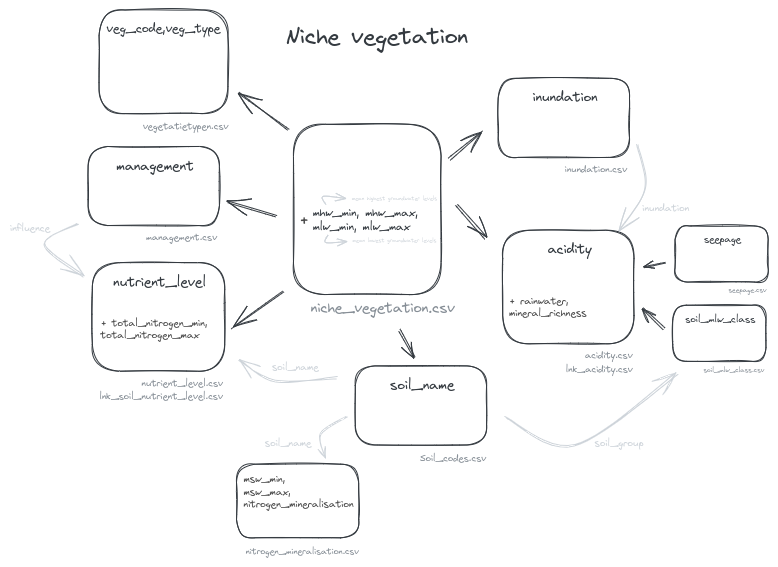
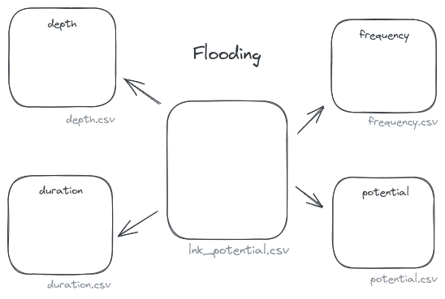

#################
Code tables
#################

.. warning::
  The Niche code tables are published on `Zenodo <https://zenodo.org/records/10521548>`_ as a reference. These files are used by the package and stored in the `niche_vlaanderen/system_tables` subdirectory. To check if your current Niche version corresponds to the latest reference data published on Zenodo, check the `Zenodo Versions section <https://zenodo.org/records/10521548>`_ and compare this with a `Niche` object output::

    >>> from niche_vlaanderen import niche
    >>> niche.Niche()
    # Niche Vlaanderen version: 1.3
    # Using latest niche_vlaanderen  1.3
    # Reference values:
    #     version: 12C                       <----- Zenodo version used in package
    #     source: 10.5281/zenodo.10417821
    #     original file: NICHE_FL_referencegroundwaterlevels_v12C.csv

  The steps to create a new release of the package with an updated data set on Zenodo is described in the :ref:`Package release documentation<release_version>`.

The logic of Niche is largely based on code tables.
They convert values (eg mlw, ...) to another (eg soil_mlw_class).
For categorical data, this happens directly. For continuous data such as
nitrogren or mhw, minimum and maximum values are used.

  .. csv-table:: interpretation of minimum and maximum values
    :header-rows: 1

    soil_name,msw_min,msw_max,nitrogen_mineralisation
    K1,5000,-5,11
    K1,-5,-10,13
    K1,-10,-15,15
    K1,-15,-20,17

Niche will use the values from the _max column to determine to which category a value has to be added.
In this particular case, with a soil_code of 10000 an MSW values ]-5,-10] will give the value 55: the upper limit is included, the lower limit is not.
A value of msw=-5 will give nitrogen_mineralisation=50 as a result, a value of msw10 will lead to nitrogen_mineralisation=55.
When using real values for mxw, the values will be rounded up to 2 decimals. Eg -50.005 will become -50.01 (< -50) and -50.004 will become -50.00 (=-50).

By default the codetables of the niche_vlaanderen package are used, but **the user can supply one or more own codetables** (see :doc:`cli`, *full example* at page bottom; see :ref:`here<niche>` for interactive implementation). If real values are used in these codetables, the decimal separator is '.' (note that no real values are used in the existing codetables).

.. _ct_soil_code:

soil_code
=========

The table `soil_codes.csv <https://github.com/INBO/niche_vlaanderen/blob/master/niche_vlaanderen/system_tables/soil_codes.csv>`_ contains the supported soil_codes in NICHE and their corresponding `soil_group` (used in determining the soil_glg_class, :ref:`soil_glg_class`).

.. _ct_management:

management
==========

The table `management.csv  <https://github.com/INBO/niche_vlaanderen/blob/master/niche_vlaanderen/system_tables/management.csv>`_ contains the supported management_codes in NICHE.
It also contains a column `influence` which is used in the calculation of nutrient level.

.. _ct_niche:

niche_vlaanderen
================

The table `niche_vegetation.csv <https://github.com/INBO/niche_vlaanderen/blob/master/niche_vlaanderen/system_tables/niche_vegetation.csv>`_ contains the link between the vegetation types that can be predicted by niche and the location factors that govern them.

Required columns are:
 * veg_code: vegetation code
 * veg_type: the vegetation name
 * soil_code: soil code, must correspond to the :ref:`soil_code`:.
 * nutrient_level
 * acidity
 * mhw_min, mhw_max:
 * mlw_min, mlw_max:
 * management
 * inundation

Other columns can exist but are ignored.

The lower and upper limits of mhw and mlw are included when classifying.

  .. csv-table:: interpretation of minimum and maximum values
    :header-rows: 1

    veg_code,veg_type,soil_name,nutrient_level,acidity,mhw_min,mhw_max,mlw_min,mlw_max
    1,Sphagno-Betuletum,KV,2,1,-20,-1,-38,-20

In the above case, mhw values -20 and -1 both fullfill the required range.

system table relation
=====================

The following images illustrate the relation between the individual code tables for respectively niche-vegetation and flooding:

