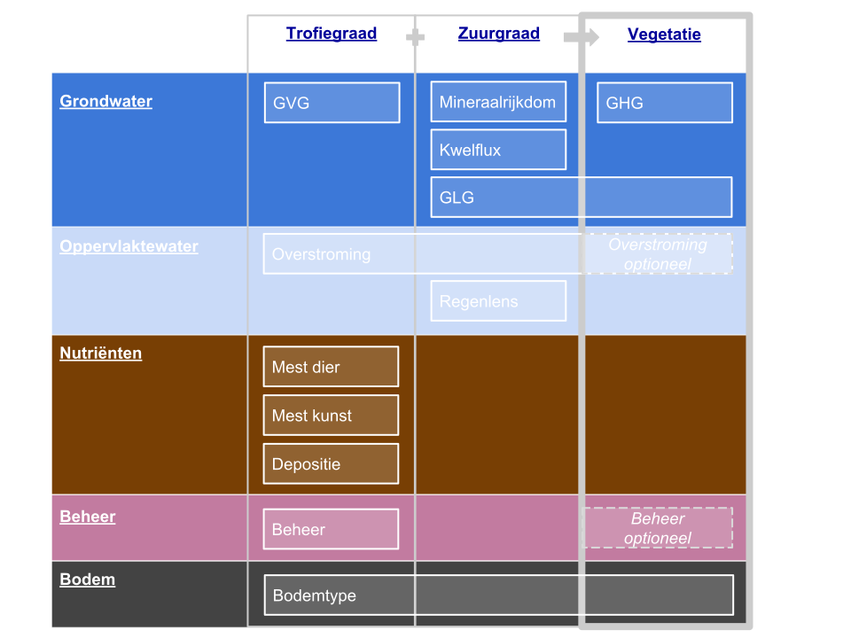

##############
Invoer rasters
##############

NICHE Vlaanderen berekent de potenties voor vegetatietypes in een gebied op basis van informatie over de (abiotische) standplaatscondities. De standplaatscondities dienen vervat te zijn in de zgn. invoergegevens: ruimtelijke datalagen (rasters) met voor elke standplaatsfactor de toestand voor elke rastercel, uitgedrukt in numerieke vorm, als een continue, ordinale of nominale waarde. Het model combineert de verschillende rasters tot een uitspraak over de potentie voor de verschillende vegetatietypen in elke rastercel op basis van beslisregels.

De betrouwbaarheid van de berekende potenties wordt sterk bepaald door de kwaliteit van de invoergegevens. Het is dan ook nodig te streven naar invoergegevens die de toestand (actueel of toekomstig) zo nauwkeurig mogelijk beschrijven. Hydrologische informatie (grondwaterstanden, overstromingen, kwel) speelt een cruciale rol, aangezien ze doorweegt in zowel de beslisregels als de berekening van potenties voor de vegetatietypen zelf.

Alle invoerdatalagen dienen aangeleverd te worden als rasters (grids). Afhankelijk van de grootte van het studiegebied wordt een voorstel gedaan voor de rasterresolutie (afmetingen rastercel). Alle rasters dienen eenzelfde gebied af te dekken met eenzelfde resolutie. Ook het ruimtelijk referentiesysteem dient hetzelfde te zijn voor alle rasters. 

Om NICHE Vlaanderen in al zijn toe te passen, kunnen 15 invoerrasters ingebracht worden. Twee hiervan zijn optioneel omdat ze een post-hoc aftoetsing inhouden van de berekende potenties naar compatibiliteit met :ref:`beheer<management_vegetation>` en :ref:`overstromingsregime<inundation_vegetation>`.

Hieronder wordt voor elk van de mogelijke invoerrasters een omschrijving gegeven van de informatie die het dient te bevatten, waarvoor het raster in het model gebruikt wordt, de eenheid waarin de rasterwaarden uitgedrukt worden, het gegevenstype, de eventueel onderscheiden klassen en hun verklaring, of het raster verplicht of optioneel is, en welke brongegevens kunnen gebruikt worden om het raster aan te maken.

1. :ref:`Bodemklasse<soil_code>`
2. :ref:`Gemiddelde hoogste grondwaterstand<mhw>`
3. :ref:`Gemiddelde laagste grondwaterstand<mlw>`
4. :ref:`Gemiddelde voorjaarsgrondwaterstand<msw>`
5. :ref:`Kwelflux<seepage>`
6. :ref:`Overstroming i.f.v. zuurgraad<inundation_acidity>`
7. :ref:`Overstroming i.f.v. trofiegraad<inundation_nutrient>`
8. :ref:`Atmosferische depositie (stikstof)<nitrogen_atmospheric>`
9. :ref:`Bemesting met dierlijke mest (stikstof)<nitrogen_animal>`
10. :ref:`Bemesting met kunstmest (stikstof)<nitrogen_fertilizer>`
11. :ref:`Beheer i.f.v. trofiegraad<management>`
12. :ref:`Mineraalrijkdom<minerality>`
13. :ref:`Regenlens<rainwater>`
14. :ref:`Aftoetsing potenties aan beheer<management_vegetation>`
15. :ref:`Aftoetsing potenties aan overstromingsregime<inundation_vegetation>`

Onderstaande figuur geeft de verschillende invoerrasters weer, thematisch geordend (verticaal) en ingedeeld naar hun indirecte (via zuur- en trofiegraad) en directe invloed op de potenties voor de verschillende vegetatietypen (horizontaal).

.. _soil_code:

Bodemklasse ``soil_code``
=========================

Omschrijving
------------
De bodemkaart die als input dient voor NICHE Vlaanderen is een ecologisch getinte bodemkaart met klassen die niet enkel onderscheiden worden op basis van korrelgrootte (zand-leem-klei), maar ook het gehalte aan organische stof (zuiver mineraal-venig-veen).

Datatype
--------
Nominaal

Mogelijke waarden
-----------------
.. csv-table:: Onderscheiden bodemklassen met hun code en beschrijving ( :ref:`ct_soil_code`)
  :header-rows: 1
  :file: ../niche_vlaanderen/system_tables/soil_codes.csv
  
Eenheid
-------
Geen

Rol in model
------------
De NICHE bodemkaart speelt een rol:

- bij de berekening van zowel de :doc:`trofie-<trofie>` als de :doc:`zuurgraad<zuur>`, inclusief aflijnen van beslisregels
- bij het rechtstreeks aftoetsen aan de compatibele bodemklassen van elk vegetatietype in de `referentietabel van NICHE Vlaanderen <https://github.com/INBO/niche_vlaanderen/blob/master/niche_vlaanderen/system_tables/niche_vegetation.csv>`_.

Brongegevens
------------
Voor het aanmaken van deze ecologische NICHE bodemkaart kan er gebruik gemaakt worden van de Bodemkaart van België, van een gecorrigeerde bodemkaart (op basis van veldgegevens) of er kan gebruik gemaakt worden van een zelf aangemaakte bodemkaart. Er is een Vlaanderen dekkende NICHE bodemkaart voorhanden, waarin voor Vlaanderen de oorspronkelijke bodemcodes van de Belgische Bodemkaart werden omgezet naar de NICHE-codes via een bodemvertaalsleutel (Callebaut et al. 2007). Aan elke polygoon hangt dus de juiste NICHE bodemcode (zowel letter- als cijfercode). Deze NICHE bodemkaart is beschikbaar onder de vorm van `deze shapefile <https://drive.google.com/open?id=0BwApsnryHxkcQVRMWFdKRndRY1U>`_. Uit deze shapefile kan met gepaste GIS-bewerkingen het gewenste studiegebied geknipt worden en vervolgens verrasterd met de gewenste extent en resolutie.

Opmerkingen
-----------

.. _mxw:

Gemiddelde grondwaterstanden (GxG)
==================================

Omschrijving
------------
De diepte van het grondwaterpeil ten opzichte van het maaiveld is voor veel vegetatietypen een uiterst belangrijke standplaatsfactor. De kenmerkende plantensoorten van een (grondwaterafhankelijk) vegetatietype zijn voor hun voortbestaan immers aangewezen op een voldoende vochtvoorziening. Niet enkel de diepte van het grondwater, maar ook de fluctuatie hiervan doorheen het jaar zijn bepalend voor welke soorten op bepaalde plaatsen kunnen groeien.

De meeste plantensoorten verdwijnen ook niet zomaar na kortstondig afwijkende grondwaterpeilen. Vandaar wordt het voorkomen van vegetatietypen niet afgetoetst ten opzichte van grondwaterpeilen die gedurende één enkel jaar of seizoen waargenomen of modelmatig voorspeld worden, maar ten opzichte van gemiddelde grondwaterpeilen over meerdere jaren.

Vandaar wordt voor het berekenen van de invloed van grondwaterpeilen op de potenties van vegetatietypen in NICHE Vlaanderen gebruik gemaakt van gemiddelde grondwaterstanden op bepaalde momenten van het jaar. Er wordt gewerkt met drie afzonderlijke invoerrasters, nl. de :ref:`Gemiddelde Laagste Grondwaterstand (GLG)<mlw>`, de :ref:`Gemiddelde Voorjaarsgrondwaterstand (GVG)<msw>` en de :ref:`Gemiddelde Hoogste Grondwaterstand (GHG)<mhw>`.

De waterstandsparameters worden als volgt gedefinieerd (van der Veen et al., 1994)

.. _mhw:

GHG (Gemiddeld hoogste grondwaterstand) ``mhw``
^^^^^^^^^^^^^^^^^^^^^^^^^^^^^^^^^^^^^^^^^^^^^^^

GHG - gemiddeld hoogste grondwaterstand: het gemiddelde van de drie hoogste grondwaterstanden (GH3) per (hydrologisch) jaar over tenminste 5 jaar bij kleine variatie tussen GH3 en LG3 en over 8 jaar bij grote variatie tussen GH3 en LG3.
Het is een maat voor het hoogste grondwaterniveau in een normale winter.

.. _mlw:

GLG (gemiddeld laagste grondwaterstand) ``mlw``
^^^^^^^^^^^^^^^^^^^^^^^^^^^^^^^^^^^^^^^^^^^^^^^

GLG - gemiddeld laagste grondwaterstand: het gemiddelde van de drie laagste grondwaterstanden (GL3) per (hydrologisch) jaar over tenminste 5 jaar bij kleine variatie tussen GH3 en LG3 en over 8 jaar bij grote variatie tussen GH3 en LG3.
Het is een maat voor het laagste niveau in een gemiddelde zomer.

.. _msw:

GVG (gemiddeld voorjaarsgrondwaterstand) ``msw``
^^^^^^^^^^^^^^^^^^^^^^^^^^^^^^^^^^^^^^^^^^^^^^^^

GVG - gemiddelde voorjaarsgrondwaterstand: de gemiddelde grondwaterstand aan het begin van het groeiseizoen (= gemiddelde van de drie metingen die het dichtst bij 1 april liggen (GV3); kunnen metingen zijn van twee opeenvolgende hydrologische jaren aangezien hydrologisch jaar start op 1 april).
Indien niet gekend kan de GVG afgeleid worden uit de formule: GVG = 5,4 + 0,83*GHG + 0,19*GLG (in cm).

Datatype
--------
Continu, integer

Mogelijke waarden
-----------------
Voor NICHE Vlaanderen moeten de waarden van de gemiddelde grondwaterstanden uitgedrukt worden in centimeter ten opzichte van het maaiveld. Een tweede aandachtspunt is het teken van de waarden: GXG-waarden boven het maaiveld zijn negatief, waterstanden onder maaiveld positief. 

Eenheid
-------
cm; negatief boven maaiveld, positief onder maaiveld

Rol in model
------------
De gemiddelde grondwaterstanden spelen een rol:

- bij de berekening van zowel de :doc:`trofie-<trofie>` (via GVG) als de :doc:`zuurgraad<zuur>` (via GLG), inclusief aflijnen van beslisregels
- bij het rechtstreeks aftoetsen aan de grenswaarden van GLG en GHG van elk vegetatietype in de `referentietabel van NICHE Vlaanderen <https://github.com/INBO/niche_vlaanderen/blob/master/niche_vlaanderen/system_tables/niche_vegetation.csv>`_.

Brongegevens
------------
Elk invoerraster moet gebiedsdekkend informatie aanleveren. Grondwaterpeilen worden op het terrein opgemeten op welbepaalde meetpunten. De meetpunten zullen echter nooit de vereiste ruimtelijke resolutie hebben om zonder meer een invoerraster mee op te stellen. Ook de temporele resolutie kan ontoereikend zijn om GXG's af te leiden, rechtstreeks uit de metingen. Dit wordt ondervangen door te werken met gemodelleerde grondwaterpeilen. Een grondwatermodel laat toe om peilen (in feite hydrostratische drukken) af te leiden met de gewenste ruimtelijke en temporele resolutie. De gesimuleerde peilen ter hoogte van elke rastercel worden dan gebruikt om GXG's te berekenen volgens bovenstaande definities. Werkelijk gemeten peilen op het terrein blijven evenwel noodzakelijk om het grondwatermodel op zich te kalibreren met als doel de modelmatig gesimuleerde peilen zo goed mogelijk te laten aansluiten op de effectief gemeten waarden. Richtlijnen voor het opstellen van een grondwatermodel in functie van de onderzoeksvraag of verwachte impact van een ingreep in de waterhuishouding zijn o.a. terug te vinden als bijlage bij de praktische wegwijzer voor het opstellen van een passende beoordeling van ingrepen die een verdroging of vernatting van de standplaats kunnen veroorzaken (`Van Daele & De Bie, 2015 <https://pureportal.inbo.be/portal/nl/publications/leidraad-grondwatermodellering-voor-passende-beoordeling(5a1c0838-c361-466f-8e38-10b5e7437b38).html>`_). Een belangrijk voordeel van het gebruik van een grondwatermodel is de mogelijkheid om naast een gebiedsdekkende weergave van de actuele toestand ook de impact van geplande ingrepen in de waterhuishouding door te rekenen in termen van verwachte GXG's. Op die manier kan NICHE Vlaanderen gebruikt worden om voorspellingen van het voorkomen van vegetatietyepn te doen onder verschillende scenario's met elk hun set van geplande ingrepen.

De beschikbaarheid van grondwaterpeilmetingen voor de Vlaamse natuurgebieden is na te gaan in de online `WATINA+ databank <http://data.inbo.be/watina/Pages/Common/Default.aspx>`_. Zowel grondwaterpeilen als fysico-chemische metingen van het grondwater zijn hier te consulteren. Let wel: peilen in de WATINA+ databank zijn positief boven maaiveld en negatief onder maaiveld. Net het tegenovergestelde als NICHE Vlaanderen vereist.

Opmerkingen
------------

.. _seepage:

Kwel ``seepage``
================

Omschrijving
------------
De kwelkaart is een kaart die aangeeft welke kwelflux in iedere cel van toepassing is.
Hoewel deze kaart in principe bestaat uit continue waarden, maakt NICHE Vlaanderen gebruik van de volgende omslagpunten in de beslisregels van het model:

 * kwel < -1 mm/dag veel kwel
 * kwel -1 - -0.1 mm/dag weinig kwel
 * kwel > 0.1 mm/dag geen kwel
 
Negatieve waarden worden gebruikt voor plaatsen waar grondwater uittreedt, positieve waarden
duiden op infiltratie.

Datatype
--------
continu, integer

Mogelijke waarden
-----------------
Negatieve waarden worden gebruikt voor plaatsen waar grondwater uittreedt, positieve waarden
duiden op infiltratie.

Eenheid
-------
mm/dag; negatief waar grondwater uittreedt, postief waar grondwater infiltreert

Rol in model
------------
In NICHE Vlaanderen wordt de kwelflux samen met de :ref:`mineraalrijkdom<minerality>` van het grondwater, de aanwezigheid van een :ref:`regenwaterlens<rainwater>`, het optreden van :ref:`overstromingen<inundation_acidity>` en de interactie tussen bodem en grondwaterstand gebruikt om de zuur-basen toestand (zie :ref:`acidity`) van de bestudeerde locaties in te schatten. Meer specifiek worden bovengenoemde klassen van kwelintensiteit gebruikt in de beslisregel voor de bepaling van de zuurgraad. Kwel is niet belangrijk als fysische parameter op zich. De relevante vraag voor het model is of er tijdens een belangrijk deel van het jaar mineraalrijke kwel uittreedt in de wortelzone. Het type kwel dat van belang is voor NICHE Vlaanderen is een opwaartse, oppervlakkige grondwaterstroming naar de wortelzone.

Brongegevens
------------
De kwelflux wordt op basis van de resultaten van een tijdsafhankelijk grondwatermodel bepaald. Idealiter wordt de gemiddelde kwel (in mm/dag) per cel en gemodelleerde periode berekend. De manier waarop dit gebeurt kan door de grondwatermodelleerder zelf worden gekozen afhankelijk van de opbouw van het model. 

Bijvoorbeeld:

- DRAIN module in MODFLOW gebruiken, met conditie opgelegd over de ganse gemodelleerde zone, om te bepalen hoeveel kwel al dan niet aanwezig is in een rastercel;
- kwel afleiden uit verschillen in stijghoogtes tussen 2 oppervlakkige lagen in het grondwatermodel: in zones met een ondiepe grondwaterstand (bv. ondieper dan 25 cm) én een opwaartse druk wordt de aanwezigheid van kwel verondersteld.

De gemiddelde kwelflux per cel en per gemodelleerde periode dient als basis voor de berekening van de invoerlagen voor NICHE Vlaanderen. Hiervoor wordt er gekeken in welke zones er gedurende respectievelijk minstens 8, 10 en 12 maanden per (hydrologisch) jaar een opwaarste kweldruk groter dan respectievelijk 0,1 en 1 mm/dag voorkomt, gemiddeld bekeken over de modelperiode. Met andere woorden: is er in cel x gemiddeld meer dan y maanden per jaar minstens z mm/d kwel?

Dit resulteert in 6 binaire invoerlagen die elk op hun verklarende waarde afgetoetst kunnen worden via expertoordeel of na kalibratie van een NICHE Vlaanderen modelrun met de betreffende kwelkaart als input:

Kwel 

-	zones met kwelflux minstens 8 maanden/j < -0,1 mm/dag, gemiddeld over de gemodelleerde periode
-	zones met kwelflux minstens 10 maanden/j < -0,1  mm/dag, gemiddeld over de gemodelleerde periode
-	zones met kwelflux minstens 12 maanden/j < -0,1  mm/dag, gemiddeld over de gemodelleerde periode

Veel kwel (is dus een onderdeel van de overeenkomende lagen voor “kwel”)

-	zones met kwelflux minstens 8 maanden/j < -1 mm/dag, gemiddeld over de gemodelleerde periode
-	zones met kwelflux minstens 10 maanden/j < -1 mm/dag, gemiddeld over de gemodelleerde periode
-	zones met kwelflux minstens 12 maanden/j < -1 mm/dag, gemiddeld over de gemodelleerde periode

Afhankelijk van de opbouw van het grondwatermodel kunnen alternatieve berekeningswijzen voorgesteld worden.

Een belangrijk voordeel van het gebruik van een grondwatermodel is de mogelijkheid om naast een gebiedsdekkende weergave van de *actuele* kwelflux ook de impact van geplande ingrepen in de waterhuishouding door te rekenen in termen van *verwachte* kweldruk. Op die manier kan NICHE Vlaanderen gebruikt worden om voorspellingen van het voorkomen van vegetatietyepn te doen onder verschillende scenario's met elk hun set van geplande ingrepen.

Opmerkingen
-----------

.. _inundation_nutrient:

Overstroming_trofie ``inundation_nutrient``
===========================================

Omschrijving
------------
Overstromingen met voedselrijk water die met een zekere regelmaat terugkeren, hebben invloed op de trofie van de standplaats die relevant is voor de vegetatie. Meestal gaat het hier over overstromingen die frequent optreden, bijvoorbeeld jaarlijks of maximaal 2-jaarlijks. Indien het overstromingswater betreft met weinig nutriënten, of wanneer er geen overstromingen plaatsvinden, dan heeft de kaart overal een waarde 0.

Datatype
--------
Nominaal

Mogelijke waarden
-----------------
 
- 0: geen frequente overstroming met voedselrijk water;
- 1: frequente (jaarlijkse of 2-jaarlijkse) overstroming met voedselrijk water)

Eenheid
-------
geen

Rol in model
------------
Dit binaire invoerraster geeft aan of de berekende :doc:`trofiegraad<trofie>` (indien lager dan eutroof) op basis van de overige variabelen (mineralisatie bodem, stikstofinput uit depositie en bemesting, beheer en bodemtype) nog met een klasse verhoogd moet worden of niet (tot maximum de klasse eutroof). De trofiegraad bepaalt samen met de zuurgraad, het bodemtype en de grondwaterstanden de potenties voor elk van de vegetatietypen.

Brongegevens
------------
Men kan bestaande overstromingskaarten gebruiken, eventuele eigen karteringen, of de resultaten van een oppervlaktewatermodel. Bemerk dat het hier moet gaan om zeer frequente (i.e. jaarlijks of minstens 2-jaarlijks) overstromingen met bovendien voedselrijk water. Zoniet wordt er in NICHE Vlaanderen geen impact gekoppeld van overstromingen op de trofiegraad. In oppervlaktewatermodellen is er aan dergelijke korte retourperioden vaak een hoge mate van onzekerheid verbonden.

Los van de invloed op de trofiegraad laat het NICHE Vlaanderen model ook toe om de potenties van vegetatietypen af te toetsen aan een inschatting van de overtromingstolerantie op zich (zie :ref:`inundation_vegetation`). Dat is optioneel en houdt een sterke vereenvoudiging van de werkelijke impact van overstromingen in. In de meer uitgebreide :doc:`overstromingsmodule<overstroming>` is het mogelijk om de voorspelde potenties volgens NICHE Vlaanderen bijkomend te confronteren met meer gedetailleerde gebiedsinformatie over overstromingen (frequentie, duur, tijdstip, diepte).

Opmerkingen
-----------
Voor veel valleigebieden in Vlaanderen bestaan er gevalideerde overstromingsgevaarkaarten met een retourperiode van 10 jaar. Deze zijn raadpleegbaar via www.waterinfo.be of in te laden vanuit `deze ArcGis Map Server <http://inspirepub.waterinfo.be/arcgis/rest/services/gevaarkaarten/MapServer/>`_ ("Grote kans" = retourperiode 10 jaar). Hoewel deze retourperiode lager ligt dan de hier beoogde frequentie van 1 of 2 jaar, kan deze kaart toch een belangrijke vertreksbasis vormen voor het aanduiden van de effectief en zeer frequent overstroomde delen van het studiegebied.

Deze informatie dient vervolgens nog gecombineerd te worden met het al of niet voedselrijk zijn van het overstromingswater. Hiervoor kunnen eigen metingen of publiek beschikbare informatie uit het `(oppervlakte)waterkwaliteitsmeetnet van VMM <http://geoloket.vmm.be/Geoviews/>`_ gebruikt worden.

.. _inundation_acidity:

Overstroming_zuurgraad ``inundation_acidity``
=============================================
 
Omschrijving
------------
Naast een invloed op de trofiegraad hebben overstromingen ook een potentiële invloed op de zuurgraad van de standplaats, die dan weer doorwerkt naar de potenties voor de verschillende vegetatietypen. Analoog worden ook hier enkel overstromingen die frequent optreden in rekening gebracht, bijvoorbeeld jaarlijks of maximaal 2-jaarlijks. Indien het overstromingswater betreft met mineraalarm/zuur water (bv. in veengebieden), of wanneer er geen frequente overstromingen plaatsvinden, krijgt het invoerraster overal een waarde 0.

Datatype
--------
Nominaal

Mogelijke waarden
-----------------

- 0: geen frequente overstroming met voedselrijk water;
- 1: frequente (jaarlijkse of 2-jaarlijkse) overstroming met voedselrijk water)

Eenheid
-------
geen

Rol in model
------------
Dit binaire invoerraster stuurt mee de :doc:`berekening van de zuurgraad<zuur>` aan, die dan weer samen met de trofiegraad, het bodemtype en de grondwaterstanden aangeeft waar de potenties liggen voor de verschillende vegetatietypen.

Brongegevens
------------
Men kan bestaande overstromingskaarten gebruiken, eventuele eigen karteringen, of de resultaten van een oppervlaktewatermodel. Bemerk dat het hier moet gaan om zeer frequente (i.e. jaarlijks of minstens 2-jaarlijks) overstromingen met bovendien voedselrijk water. Zoniet wordt er in NICHE Vlaanderen geen impact gekoppeld van overstromingen op de zuurgraad. In oppervlaktewatermodellen is er aan dergelijke korte retourperioden vaak een hoge mate van onzekerheid verbonden.

Los van de invloed op de zuurgraad laat het NICHE Vlaanderen model ook toe om de potenties van vegetatietypen af te toetsen aan een inschatting van de overtromingstolerantie op zich (zie :ref:`inundation_vegetation`). Dat is optioneel en houdt een sterke vereenvoudiging van de werkelijke impact van overstromingen in. In de meer uitgebreide :doc:`overstromingsmodule<overstroming>` is het mogelijk om de voorspelde potenties volgens NICHE Vlaanderen bijkomend te confronteren met meer gedetailleerde gebiedsinformatie over overstromingen (frequentie, duur, tijdstip, diepte).

Opmerkingen
-----------
Voor veel valleigebieden in Vlaanderen bestaan er gevalideerde overstromingsgevaarkaarten met een retourperiode van 10 jaar. Deze zijn raadpleegbaar via www.waterinfo.be of in te laden vanuit `deze ArcGis Map Server <http://inspirepub.waterinfo.be/arcgis/rest/services/gevaarkaarten/MapServer/>`_ ("Grote kans" = retourperiode 10 jaar). Hoewel deze retourperiode lager ligt dan de hier beoogde frequentie van 1 of 2 jaar, kan deze kaart toch een belangrijke vertreksbasis vormen voor het aanduiden van de effectief en zeer frequent overstroomde delen van het studiegebied.

Deze informatie dient vervolgens nog gecombineerd te worden met de zuurtegraad/mineraalrijkdom van het overstromingswater. Hiervoor kunnen eigen metingen of publiek beschikbare informatie uit het `(oppervlakte)waterkwaliteitsmeetnet van VMM <http://geoloket.vmm.be/Geoviews/>`_ gebruikt worden.

.. _nitrogen_atmospheric:

Atmosferische depositie ``nitrogen_atmospheric``
================================================

Omschrijving
------------
Het invoerraster met de atmosferische depositie beoogt zo goed mogelijk de eigenlijke neerslag van (zowel droge als natte) stikstof vanuit de lucht weer te geven in het studiegebied . Stikstof is een belangrijke bron van eutrofiëring en bepaalt dus in sterke mate de trofiegraad waaraan NICHE Vlaanderen de potenties van de verschillende vegetatietypen aftoetst.

Datatype
--------
Continue, integer

Mogelijke waarden
-----------------
positief

Eenheid
-------
kg N/ha/jaar

Rol in model
------------
De invoerlaag met de inschatting van de atmosferische depositie is onderdeel van de berekening van de :ref:`trofiegraad<nutrient_level>`), net als de stikstofmineralisatie van de bodem, de bemesting, het beheer en de regelmatige overstroming met voedselrijk oppervlaktewater.

Brongegevens
------------
Momenteel ontsluit de Vlaamse Milieumaatschappij (VMM) de gemodelleerde `totale vermestende stikstofdepositie <https://metadata.geopunt.be/zoekdienst/srv/dut/csw?service=CSW&version=2.0.2&request=GetRecordById&outputFormat=application%2Fxml&outputSchema=http%3A%2F%2Fwww.opengis.net%2Fcat%2Fcsw%2F2.0.2&elementsetname=full&id=dddd12f8-66f5-46bc-9ae5-40954e23b06b>`_ als een Vlaanderen dekkende rasterkaart met een resolutie van 1 km\ :sup:`2`\  (WCS mogelijk). Hierbij wordt rekening gehouden met verschillen in depositiesnelheden tussen de overheersende landgebruiksvormen.

De resolutie van 1 km\ :sup:`2`\  is uiteraard grof, wetende dat de aanbevolen resolutie van een invoerraster 25x25 m bedraagt. Desgewenst kan er op fijnere schaal nog rekening gehouden worden met het werkelijke landgebruik op basis van de BWK-Habitatkaart of een (toekomstige) beheerkaart. Hiervoor is evenwel kennis nodig over de interactie tussen concentraties in de lucht en het landgebruik (ruwheidslengtes, depositiesnelheden, etc.).

Opmerkingen
-----------

.. _nitrogen_animal:

Dierlijke bemesting ``nitrogen_animal``
=======================================

Omschrijving
------------
De gift in de vorm van dierlijke organische mest kan een belangrijke bron van stikstof zijn in de bodem. Het bepaalt mede de trofiegraad van de standplaats. Dit invoerraster heeft als waarde voor elke rastercel de hoeveelheid organische stikstof toegevoegd onder de vorm van dierlijke mest.

Datatype
--------
Continue, integer

Mogelijke waarden
-----------------
positief

Eenheid
-------
kg N/ha/jaar

Rol in model
------------
De gift aan dierlijke mest bepaalt mede de :ref:`trofiegraad<nutrient_level>` waaraan de potentiële aanwezigheid van de verschillende vegetatietypen wordt afgetoest.

Brongegevens
------------
Indien reële mestgiften gekend zijn op perceelsniveau kunnen ze omgerekend worden naar de hoeveelheid stikstof per ha en per jaar. Bij afwezigheid van deze informatie kunnen schattingen gemaakt worden op basis van een landgebruikskaart waarvoor aan elk landgebruik standaard een bepaalde hoeveelheid stikstof wordt toegekend (zie onderstaande tabel). Zo werd voor NICHE Vlaanderen een :download:`omzettingstabel</_data/tblBWK_BeheerBemesting.csv>` gemaakt met voor elke gedetailleerde landgebruikscode uit de Biologische Waarderingskaart (BWK) een vereenvoudigde landgebruiksklasse met een overeenkomstige bemestingsklasse. Die vereenvoudigde landgebruiksklassen kunnen ook gebruikt worden bij het schatten van de stikstofgift afkomstig uit kunstmest.

+-------------------------+---------------------------------------------+-----------------------------------------------------------------------------------------------+
| Landgebruiksklasse      | Bemesting                                   | Omschrijving                                                                                  |
+=========================+=============================================+===============================================================================================+
| 0 Natuurgebieden        | 0 kg N/ha/jaar                              | rietruigten, naaldbossen, loofbossen (broekbossen, populierenaanplanten,…)                    |
|                         |                                             | extensief begraasde gronden                                                                   |
|                         | geen enkele vorm van bemesting              +-----------------------------------------------------------------------------------------------+
|                         |                                             | natuurlijke graslanden, niet bemeste hooilanden                                               |
+-------------------------+---------------------------------------------+-----------------------------------------------------------------------------------------------+
| 1 Extensief landgebruik | 75 kg N/ha/jaar                             | intensief begraasde gronden                                                                   |
|                         | Extensieve bemestingsdruk (veelal dierlijk) +-----------------------------------------------------------------------------------------------+
|                         |                                             | weinig bemeste hooilanden                                                                     |
+-------------------------+---------------------------------------------+-----------------------------------------------------------------------------------------------+
| 2 Intensief landgebruik | 350 kg N/ha/jaar (dierlijke mest)           | het maaibeheer heeft door de hoge nutriënten-input geen invloed op de trofieberekening meer   |
|                         | + 250 kg N/ha/jaar (kunstmest)              |                                                                                               |
+-------------------------+---------------------------------------------+-----------------------------------------------------------------------------------------------+

Opmerkingen
-----------

.. _nitrogen_fertilizer:

Kunstmest ``nitrogen_fertilizer``
=================================

Omschrijving
------------
De gift in de vorm van kunstmest kan een belangrijke bron van stikstof zijn in de bodem. Het bepaalt mede de trofiegraad van de standplaats. Dit invoerraster heeft als waarde voor elke rastercel de hoeveelheid anorganische stikstof toegevoegd onder de vorm van kunstmest.

Datatype
--------
Continue, integer

Mogelijke waarden
-----------------
positief

Eenheid
-------
kg N/ha/jaar

Rol in model
------------
De gift via kunstmest bepaalt mede de :ref:`trofiegraad<nutrient_level>` waaraan de potentiële aanwezigheid van de verschillende vegetatietypen wordt afgetoest.

Brongegevens
------------
Indien reële mestgiften gekend zijn op perceelsniveau kunnen ze omgerekend worden naar de hoeveelheid stikstof per ha en per jaar. Bij afwezigheid van deze informatie kunnen schattingen gemaakt worden op basis van een landgebruikskaart waarvoor aan elk landgebruik standaard een bepaalde hoeveelheid stikstof wordt toegekend (zie bovenstaande tabel). Zo werd voor NICHE Vlaanderen een :download:`omzettingstabel</_data/tblBWK_BeheerBemesting.csv>` gemaakt met voor elke gedetailleerde landgebruikscode uit de Biologische Waarderingskaart (BWK) een vereenvoudigde landgebruiksklasse met een overeenkomstige bemestingsklasse. Dezelfde vereenvoudigde landgebruiksklassen kunnen ook gebruikt worden bij het schatten van de stikstofgift afkomstig uit dierlijke mest.

Opmerkingen
-----------

.. _management:

Beheer ``management``
=====================

Omschrijving
------------
Dit invoerraster beschrijft (de intensiteit van) het gevoerde of te voeren beheer voor elke rastercel in het studiegebied en werkt onrechtstreeks in op de potenties van de vegetatietypen via de bijdrage aan de berekening van de trofiegraad.

Datatype
--------
Ordinaal/Nominaal

Mogelijke waarden
-----------------
.. csv-table:: Onderscheiden beheerklassen met hun code en korte beschrijving ( :ref:`ct_management`)
  :header-rows: 1
  :file: ../niche_vlaanderen/system_tables/management.csv

Eenheid
-------
geen

Rol in model
------------
In NICHE Vlaanderen heeft het gevoerde beheer een impact op twee niveaus.

Enerzijds heeft het een effect op de :doc:`trofiegraad<trofie>`: die daalt met één eenheid/klasse als het beheer hoogfrequent is (maaien met afvoer van maaisel). Het (verplichte) invoerraster draagt dus *onrechtstreeks* bij tot de potentieberekeningen voor de verschillende vegetatietypen in het NICHE Vlaanderen model.

Anderzijds kunnen de berekende potenties voor elk van de vegetatietypen finaal ook afgetoetst worden op basis van hun compatibiliteit met het gevoerde of te voeren beheer. In tegenstelling tot de onrechtstreekse bijdrage van het beheer via de trofiegraad, werkt het beheer dan *rechtstreeks* in op de potentievoorspellingen. Want hoewel de standplaats abiotisch perfect geschikt kan zijn voor een bepaald vegetatietype, is het immers mogelijk dat het nooit aanwezig kan zijn als het gevoerde of te voeren beheer het voortbestaan of de ontwikkeling ervan in de weg staat. Zo kunnen bostypen zich bijvoorbeeld niet ontwikkelen als er (jaarlijks) gemaaid wordt, of kunnen graslanden niet standhouden op plaatsen zonder een maaibeheer. De compatibiliteit van elk vegetatietype met de verschillende onderscheiden beheerklassen zit vervat in de `referentietabel van NICHE Vlaanderen <https://github.com/INBO/niche_vlaanderen/blob/master/niche_vlaanderen/system_tables/niche_vegetation.csv>`_. Merk op dat deze rechtstreekse aftoetsing van de berekende potenties aan het beheer een *optionele* stap is in NICHE Vlaanderen: de aftoetsing gebeurt enkel als het invoerraster :ref:`management_vegetation` (dat inhoudelijk identiek is aan het hier besproken invoerraster) expliciet wordt gespecifieerd. Wordt deze laatste niet gespecifieerd, dan worden de potenties berekend zonder de rechtstreekse impact van het actueel gevoerde of het toekomstig beheer, dus louter op basis van de abiotische eigenschappen van de standplaats.

Brongegevens
------------
Idealiter is het beheer van elk perceel in het studiegebied gedocumenteerd en kan de beheerklasse eenvoudigweg bepaald worden op basis van deze informatie. Een studiegebied kan echter groot zijn en dus veel percelen tellen waarvan het beheer helemaal niet of slechts gedeeltelijk gedocumenteerd is. Voor elk perceel het beheer achterhalen kan dan arbeidsintensief zijn. Daarom kan men terugvallen op een generieke :download:`omzettingstabel</_data/tblBWK_BeheerBemesting.csv>` met voor elke code van de Biologische Waarderingskaart (BWK) de meest aannemelijke beheerklasse. Op die manier kan de gebiedsdekkende kartering van de BWK ten volle benut worden. Een manuele controle kan evenwel aangewezen zijn indien de informatie uit de BWK verouderd is. Houdt er ook rekening mee dat de uit de BWK afgeleide beheerkaart steeds het actuele beheer weergeeft. Indien met NICHE Vlaanderen een scenario doorgerekend wordt met een gewenst (toekomstige) beheer en dit beheer afwijkt van het huidige, dan moeten de beheerklassen overeenkomstig toegekend worden aan elke rastercel.

Opmerkingen
-----------
De grens waarmee onderscheid gemaakt wordt tussen hoog- en laagfrequent beheer is niet expliciet gedefinieerd. Belangrijk is om de rol van dit invoerraster in het achterhoofd te houden, met name het verlagen van de berekende trofiegraad met één klasse als het beheer als hoogfrequent wordt beschouwd. Een verlaging van de trofie is enkel gerechtvaardigd als bij het beheer effectief nutriënten afgevoerd worden. Bij maaien, kappen of andere beheeringrepen impliceert dit het afvoeren van het beheerresidu (maaisel, hout, plaggen, etc). Hoogfrequent houdt bovendien een jaarlijks of tweejaarlijks beheer in. Ingrepen met een lagere frequentie worden veelal als laagfrequent aangeduid. Veel cyclisch beheer valt hieronder.

.. _minerality:

Mineraalrijkdom ``minerality``
==============================

Omschrijving
------------
Het bepalen of een standplaats mineraalrijk dan wel mineraalarm grondwater heeft, kan afgeleid worden uit verschillende variabelen zoals de HCO\ :sup:`3-` en Ca\ :sup:`2+` concentraties of de elektrische conductiviteit (EC-waarde, µS/cm) van het grondwater. De waarde bepaalt of er sprake is van mineralenrijk (basenrijk) dan wel mineralenarm (basenarm) grondwater. De mineraalrijkdom kan bepaald worden op basis van opgemeten conductiviteitswaarden (>= 500µS/cm is mineraalrijk), maar ook op basis van expertkennis.

Datatype
--------
Nominaal

Mogelijke waarden
-----------------
- 0: mineraalarm (EC < 500 µS/cm of expertoordeel)
- 1: mineraalrijk (EC >= 500 µS/cm of expertoordeel)

Eenheid
-------
geen

Rol in model
------------
De mineraalrijkdom van het grondwater bepaalt mede de :ref:`zuurgraad<acidity>` van de standplaats als kwalitatief criterium in de beslisregels.

Brongegevens
------------
De `WATINA+ databank <http://data.inbo.be/watina/Pages/Common/Default.aspx>`_ is een zeer belangrijke bron van grondwatermetingen. Voor veel meetpunten zijn er een of meerdere fysico-chemische analysen uitgevoerd op grondwaterstalen. Op basis van de meetwaarden van een van bovengenoemde variabelen kan de mineraalrijkdom afgeleid worden. Ook eigen metingen kunnen gebruikt worden, en bij ontbrekende meetgegevens kan beroep gedaan worden op expertkennis. Belangrijk is dat niet de meetwaarde op zich, maar het al of niet overschrijden van de grenswaarde van 500 µS/cm (EC) doorslaggevend is. In eenzelfde gebied kan de EC van het grondwater variëren in de ruimte, maar behoren de waarden evenwel tot een van beide bovengenoemde klassen. Zeer lokaal afwijkende waarden kunnen ook te wijten zijn aan een lokale vervuiling van het grondwater (hogere EC) of stagnerend regenwater (lagere EC). Hiervan dient abstractie gemaakt bij het opstellen van het invoerraster (0/1).

Opmerkingen
-----------

.. _rainwater:

Regenlens ``rainwater``
=======================

Omschrijving
------------
NICHE Vlaanderen heeft een optie om rekening te houden met de opbouw van regenwaterlenzen. Als regenwater onvoldoende kan worden afgevoerd door een drainagesysteem, stagneert het water, en geeft het de standplaats een zuur karakter. Plaatsen waar de opbouw van regenwaterlenzen mogelijk is worden dus zuur, zelfs als de grondwaterstanden ondiep zijn en kwel een basisch karakter heeft (zie :ref:`acidity`). 

Datatype
--------
Nominaal

Mogelijke waarden
-----------------
- 0: geen regenwaterlens
- 1: regenwaterlens

Eenheid
-------
geen

Rol in model
------------
De aanwezigheid van regenlenzen speelt een rol in de beslisregels voor de :doc:`zuurgraad<zuur>` van de standplaats: plaatsen met stagnerend regenwater worden dus zuur, zelfs als de grondwaterstanden ondiep zijn en de kwel een basisch karakter heeft.

Brongegevens
------------
De informatie zal meestal bekomen worden via expertkennis over het gebied aangezien metingen moeilijk zijn. Als de nodige informatie voorhanden is, kunnen de voorziene beslisregels worden toegepast. Bij gebrek aan informatie krijgen alle gridcellen een waarde 0. 

Opmerkingen
-----------

.. _inundation_vegetation:

Overstroming Vegetatie ``inundation_vegetation``
================================================
 
Omschrijving
------------
Deze *optionele* overstromingskaart wordt enkel gebruikt bij het aftoetsen van voorspelde potenties voor de vegetatietypes aan het overstromingsregime van de standplaats, op basis van de informatie in de `referentietabel van NICHE Vlaanderen <https://github.com/INBO/niche_vlaanderen/blob/master/niche_vlaanderen/system_tables/niche_vegetation.csv>`_. Er wordt per vegetatietype nagegaan welke voorspelde potenties nog standhouden bij het aangegeven overstromingsregime en welke niet.
 
Datatype
--------
Ordinaal

Mogelijke waarden
-----------------
Er worden 3 klassen onderscheiden, nl:

.. csv-table:: Overstromingsklassen
  :header-rows: 1
  :file: ../niche_vlaanderen/system_tables/inundation.csv

Deze overstromingskaart is een samenstelling van overstromingskaarten met verschillende retourperiodes (regelmatig = retourperiode 1 tot 2 jaar, incidenteel =  retourperiode van 5 jaar). 

Eenheid
-------
geen

Rol in model
------------
Los van de *indirecte* invloed van overstromingen op de potentieberekening voor vegetatietypen via de berekening van zowel de zuur- als de trofiegraad laat het NICHE Vlaanderen model via dit invoerraster ook toe om de potenties van vegetatietypen *rechtstreeks* af te toetsen aan een inschatting van de overtromingstolerantie op zich (zie :ref:`inundation_vegetation`).
Deze aftoetsing is optioneel en houdt een sterke vereenvoudiging van de werkelijke impact van overstromingen in.
In de meer uitgebreide :doc:`overstromingsmodule<overstroming>` is het mogelijk om de voorspelde potenties volgens NICHE Vlaanderen bijkomend te confronteren met meer gedetailleerde gebiedsinformatie over overstromingen (frequentie, duur, tijdstip, diepte).

Brongegevens
------------
Men kan bestaande overstromingskaarten gebruiken, eventuele eigen karteringen, of de resultaten van een oppervlaktewatermodel. Bemerk dat het hier moet gaan om vrij frequente overstromingen (1-5 jaar). In oppervlaktewatermodellen is er aan dergelijke korte retourperioden vaak een hoge mate van onzekerheid verbonden.

Opmerkingen
-----------
Optioneel invoerraster. Potenties voor vegetatietypen kunnen ook voorspeld worden zonder rekening te houden met het huidige of geplande overstromingsregime.

Voor veel valleigebieden in Vlaanderen bestaan er gevalideerde overstromingsgevaarkaarten met een retourperiode van 10 jaar. Deze zijn raadpleegbaar via www.waterinfo.be of in te laden vanuit `deze ArcGis Map Server <http://inspirepub.waterinfo.be/arcgis/rest/services/gevaarkaarten/MapServer/>`_ ("Grote kans" = retourperiode 10 jaar). Hoewel deze retourperiode lager ligt dan de hier beoogde frequentie van 1, 2 of 5 jaar, kan deze kaart toch een belangrijke vertreksbasis vormen voor het aanduiden van de effectief regelmatig/incidenteel overstroomde delen van het studiegebied.

.. _management_vegetation:

Beheer Vegetatie ``management_vegetation``
==========================================

Omschrijving
------------
Dit *optionele* invoerraster beschrijft (de intensiteit van) het gevoerde (actueel) of te voeren (toekomstig scenario) beheer voor elke rastercel in het studiegebied en werkt rechtstreeks in op de voorspelde potenties van de vegetatietypen door de compatibiliteit tussen vegetatietypen en beheer in rekening te brengen. Hetzelfde invoerraster bepaalt ook de trofiegraad (verplichte invoer; zie :ref:`management`).

Datatype
--------
Ordinaal/Nominaal

Mogelijke waarden
-----------------
.. csv-table:: Onderscheiden beheerklassen met hun code en korte beschrijving ( :ref:`ct_management`)
  :header-rows: 1
  :file: ../niche_vlaanderen/system_tables/management.csv

Eenheid
-------
geen

Rol in model
------------
In NICHE Vlaanderen heeft het gevoerde beheer een impact op twee niveaus.

Enerzijds heeft het een effect op de :doc:`trofiegraad<trofie>` (zie invoerraster :ref:`management`) : die daalt met één eenheid/klasse als het beheer hoogfrequent is (bv. regelmatig maaien met afvoer van maaisel). Dit (verplichte) invoerraster draagt dus *onrechtstreeks* bij tot de potentieberekeningen voor de verschillende vegetatietypen in het NICHE Vlaanderen model.

Anderzijds kunnen de berekende potenties voor elk van de vegetatietypen finaal ook afgetoetst worden op basis van hun compatibiliteit met het gevoerde of te voeren beheer. In tegenstelling tot de onrechtstreekse bijdrage van het beheer via de trofiegraad, werkt het beheer dan *rechtstreeks* in op de potentievoorspellingen. Want hoewel de standplaats abiotisch perfect geschikt kan zijn voor een bepaald vegetatietype, is het immers mogelijk dat het nooit aanwezig kan zijn als het gevoerde of te voeren beheer het voortbestaan of de ontwikkeling ervan in de weg staat. Zo kunnen bostypen zich bijvoorbeeld niet ontwikkelen als er (jaarlijks) gemaaid wordt, of kunnen graslanden niet standhouden op plaatsen zonder een maaibeheer. De compatibiliteit van elk vegetatietype met de verschillende onderscheiden beheerklassen zit vervat in de `referentietabel van NICHE Vlaanderen <https://github.com/INBO/niche_vlaanderen/blob/master/niche_vlaanderen/system_tables/niche_vegetation.csv>`_. Merk op dat deze rechtstreekse aftoetsing van de berekende potenties aan het beheer een *optionele stap* is in NICHE Vlaanderen: de aftoetsing gebeurt enkel als het hier besproken invoerraster (dat inhoudelijk identiek is aan het invoerraster :ref:`management`) expliciet wordt gespecifieerd via ``set_input("management_vegetation", <pad naar invoerraster>`` voor een NICHE Vlaanderen object aangemaakt via ``niche_vlaanderen.Niche()``. Wordt het niet gespecifieerd, dan worden de potenties berekend zonder de rechtstreekse impact van het actueel gevoerde of het toekomstig beheer, dus louter op basis van de abiotische eigenschappen van de standplaats.

Brongegevens
------------
Idealiter is het beheer van elk perceel in het studiegebied gedocumenteerd en kan de beheerklasse eenvoudigweg bepaald worden op basis van deze informatie. Een studiegebied kan echter groot zijn en dus veel percelen tellen waarvan het beheer helemaal niet of slechts gedeeltelijk gedocumenteerd is. Voor elk perceel het beheer achterhalen kan dan arbeidsintensief zijn. Daarom kan men terugvallen op een generieke :download:`omzettingstabel</_data/tblBWK_BeheerBemesting.csv>` met voor elke code van de Biologische Waarderingskaart (BWK) de meest aannemelijke beheerklasse. Op die manier kan de gebiedsdekkende kartering van de BWK ten volle benut worden. Een manuele controle kan evenwel aangewezen zijn indien de informatie uit de BWK verouderd is. Houdt er ook rekening mee dat de uit de BWK afgeleide beheerkaart steeds het actuele beheer weergeeft. Indien met NICHE Vlaanderen een scenario doorgerekend wordt met een gewenst (toekomstige) beheer en dit beheer afwijkt van het huidige, dan moeten de beheerklassen overeenkomstig toegekend worden aan elke rastercel.

Opmerkingen
-----------
Optioneel invoerraster. Potenties voor vegetatietypen kunnen ook voorspeld worden zonder rekening te houden met het gevoerde of geplande beheer.

De grens waarmee onderscheid gemaakt wordt tussen hoog- en laagfrequent beheer is niet expliciet gedefinieerd. Belangrijk is om de rol van dit invoerraster in het achterhoofd te houden, met name het verlagen van de berekende trofiegraad met één klasse als het beheer als hoogfrequent wordt beschouwd. Een verlaging van de trofie is enkel gerechtvaardigd als bij het beheer effectief nutriënten afgevoerd worden. Bij maaien, kappen of andere beheeringrepen impliceert dit het afvoeren van het beheerresidu (maaisel, hout, plaggen, etc). Hoogfrequent houdt bovendien een jaarlijks of tweejaarlijks beheer in. Ingrepen met een lagere frequentie worden veelal als laagfrequent aangeduid. Veel cyclisch beheer valt hieronder.
