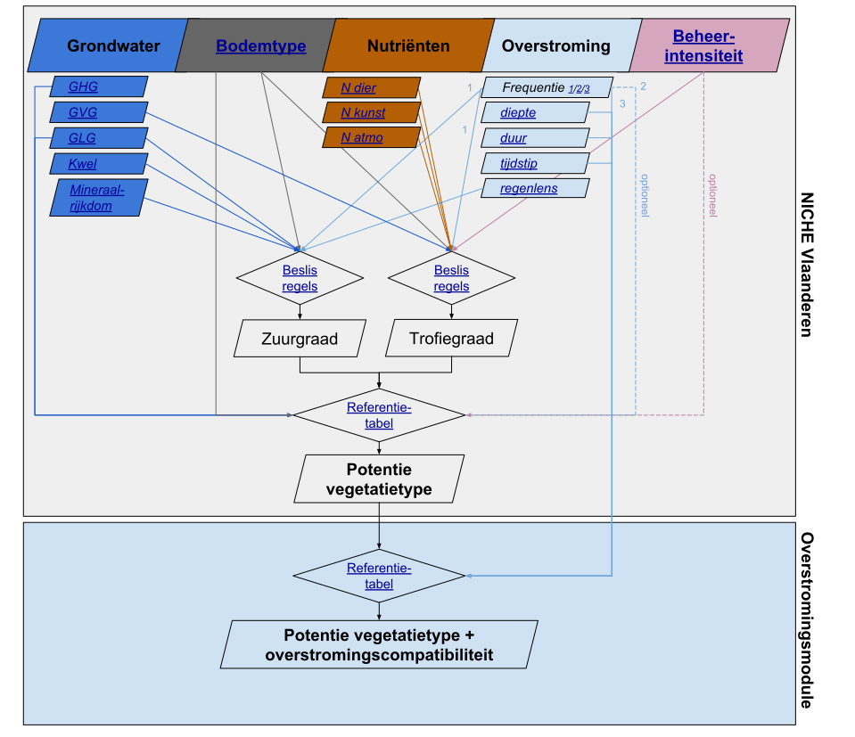

###############
In een notendop
###############

Wat
===

NICHE Vlaanderen (*Nature Impact Assessment of Changes in Hydro-Ecological Systems*) is een **hydro-ecologisch model** dat de **potenties voor (grond)waterafhankelijke vegetatietypes** in een gebied berekent **op basis van** informatie over de **(abiotische) standplaatscondities**. Met een bijkomende **overstromingsmodule** kunnen de potenties verder getoetst worden aan de compatibiliteit met een bepaald overstromingsregime.

NICHE Vlaanderen, en bij uitbreiding de overstromingsmodule, is een waardevol instrument om de ontwikkelingskansen voor vegetaties ruimtelijk expliciet in te schatten. Bijzonder handig is dat dit niet enkel kan gebeuren voor de huidige toestand, maar ook voor een geplande eindtoestand na bepaalde ingrepen of inrichtingswerken (scenario's). Op die manier is het mogelijk om de **impact van bepaalde scenario's door te rekenen en onderling te vergelijken in een zoektocht naar het meest gepaste scenario**.

**Het is belangrijk te beseffen dat het hier om een model gaat**. Niet alleen is het belangrijk om de betrouwbare invoergegevens te voorzien, ook de kritische interpretatie van de resultaten bij het fijnstellen van het model (zgn. kalibratie) blijft cruciaal om een gedegen inschatting te maken van de huidige en toekomstige potenties voor de verschillende vegetatietypen.

Werking
=======

Onderstaande figuur tracht de werking van zowel het NICHE Vlaanderen model als de post-hoc overstromingsmodule samen te vatten. Vertrekkende van de abiotische standplaatscondities (bovenaan, thematisch ingekleurd) worden via een set beslisregels en een tussentijdse berekening van de zuur- en trofiegraad de standplaatscondities afgetoetst aan de vereisten van de verschillende vegetatietypen via een referentietabel. De resulterende potenties kunnen nadien nog afgetoetst worden op hun compatibiliteit met eventuele overstromingsregimes die van toepassing zijn in het studiegebied.

De hyperlinks in de figuur verwijzen je door naar de documentatie bij het betreffende item.

Doel van deze website
=====================

Deze website heeft tot doel de **werking van NICHE Vlaanderen en de overstromingsmodule toe te lichten**, maar vooral om de achterliggende **code en beslisregels publiek beschikbaar te stellen** zodat iedereen met het model aan de slag kan. De website dient als documentatie bij de publiek beschikbare `Github repository <https://github.com/inbo/niche_vlaanderen>`_ met de programmacode.

Op deze website wordt niet alleen de werking van het :doc:`NICHE Vlaanderen model<model>` en de :doc:`overstromingsmodule<overstroming>` uitvoerig toegelicht maar wordt ook veel aandacht besteed aan de praktische toepassing van de code onder de vorm van een :doc:`installatiehandleiding<installation>` en toegepaste :doc:`tutorials<tutorials>`.

Doelgroep
=========

Enige vertrouwdheid met modelbouw, python code , gis (raster) en last but not least het ecologische functioneren van de verschillende vegetatietypen strekt tot aanbeveling als je aan de slag wilt met de programmacode. In die optiek bestaat de primaire doelgroep uit **thematische experten** van studiebureaus, openbare instellingen of niet gouvernementele organisaties. 
De modelresultaten moeten immers steeds met een kritisch oog bekeken worden en getoetst aan de realiteit (:doc:`kalibratie<kalibratie>`), vooraleer extrapolaties/simulaties van toekomstige ingrepen op de standplaatscondities modelmatig ingeschat worden.

Opbouw van de website
=====================

De documentatie is als volgt opgebouwd:

- :doc:`Beschrijving van het NICHE Vlaanderen model<model>`
- :doc:`Toelichting bij de benodigde informatie over de standplaatscondities<invoer>`
- :doc:`Hoe het model afstellen (kalibratie)?<kalibratie>`
- :doc:`Beschrijving van de overstromingsmodule en de benodigde invoergegevens<overstroming>`
- :doc:`Installatiehandleiding<installation>`
- :doc:`Tutorials<tutorials>`
