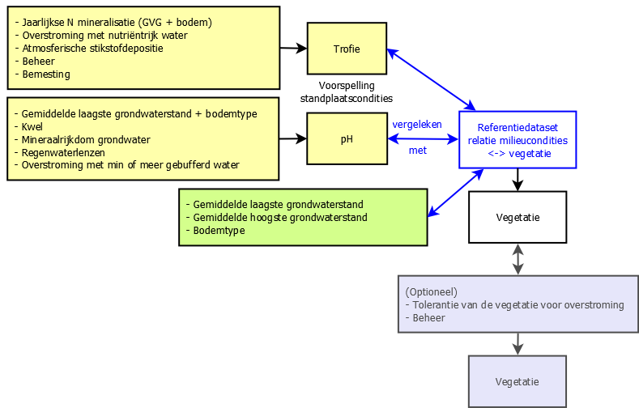

###########################
Werking NICHE Vlaanderen
###########################

NICHE Vlaanderen (*Nature Impact Assessment of Changes in Hydro-Ecological Systems*) is een 
**hydro-ecologisch model** dat de **potenties voor (grond)waterafhankelijke vegetatietypes** in een 
gebied berekent **op basis van** informatie over de **(abiotische) standplaatscondities**. 
Het model baseert zich hierbij op vier typen standplaatsfactoren (bodemtype, grondwaterstanden, 
voedselrijkdom en zuurgraad) die bepalend zijn voor de aard en de soortensamenstelling van 
vegetaties die zich op een locatie kunnen ontwikkelen.

De figuur hieronder geeft een overzicht van de verschillende inputgegevens en stappen van het model. De :doc:`invoerlagen <invoer>` worden ingelezen als (gebiedsdekkende) rasterkaarten.

	 
   Schematische weergave van de werking van het NICHE Vlaanderen model, met in het geel de invoergegevens ter berekening van de trofie en de zuurgraad (pH). Beide berekende standplaatsfactoren worden samen met de grondwaterstanden en het bodemtype (groen) afgetoetst aan de referentiewaarden/tolerantiegrenzen voor elk van de vegetatietypen in de referentiedataset (blauw omlijnd) om zo de potentie van elke locatie te bepalen. Optioneel worden die potenties nog verder begrensd door ook de tolerantie ten aanzien van overstromingen en het gevoerde beheer mee in beschouwing te nemen (blauwgrijs). GVG: gemiddelde voorjaarsgrondwaterstand.

Berekening standplaatscondities 
==================================

Eerst worden de standplaatscondities :doc:`zuurgraad <zuur>` (pH) en :doc:`trofie <trofie>` aan de hand van beslisregels berekend op basis van verschillende kenmerken met betrekking tot de waterhuishouding (overstroming, grondwaterstanden, kwel, ...), bodem en landgebruik (bemesting, beheer, ...).  Deze (optionele) stap (in bovenstaande figuur in het geel aangeduid) genereert twee vereenvoudigde rasterkaarten die de zuur- en trofiegraad van de standplaats beschrijven. In een afgeslankte versie van het model (zie verder) wordt deze stap overgeslagen.

Berekening potenties voor vegetatie-ontwikkeling 
===================================================

Vervolgens worden de standplaatskarakteristieken in het studiegebied afgetoetst aan zogenaamde tolerantie-intervallen van plantengemeenschappen (figuur hierboven, blauw omrand). Deze tolerantiegrenzen (ook `referentiewaarden <https://github.com/inbo/niche_vlaanderen/blob/master/niche_vlaanderen/system_tables/niche_vegetation.csv>`_ genoemd) zijn 
gebaseerd op veldwaarnemingen waaruit de standplaatscondities van de verschillende :doc:`vegetatietypen <vegetatietype>` werden afgeleid.

De potenties voor vegetatie-ontwikkeling kunnen op twee manieren worden berekend: 

- Enerzijds door het *volledige NICHE Vlaanderen model* (:doc:`full model <getting_started>`) te gebruiken, waarbij de berekende zuurgraad en trofie, het bodemtype en de gemiddelde laagste en hoogste grondwaterstanden mee de potenties bepalen (inputlagen in het geel en in het groen in bovenstaande figuur);
- Anderzijds door een *afgeslankte/vereenvoudigde versie* (:doc:`simple model <getting_started>`) van NICHE Vlaanderen te gebruiken, waarbij enkel een aftoetsing aan de referentiewaarden voor het bodemtype en de karakteristieke grondwaterstanden (gxg) gebeurt (enkel inputlagen in het groen in bovenstaande figuur) ter bepaling van de potenties.

Optioneel kunnen de berekende potenties dan nog verder beperkt worden naargelang de :ref:`beheersintensiteit<management_vegetation>` 
of :ref:`overstromingsfrequentie<inundation_vegetation>` (figuur hierboven, in het blauwgrijs). Vegetatietypen die geen zuurstoftekort verdragen kunnen bv. niet voorkomen op frequent overstroomde locaties, of een bostype kan zich niet ontwikkelen in zones die regelmatig gemaaid worden.

Voor elk :doc:`NICHE vegetatietype <vegetatietype>` wordt een binaire rasterkaart geproduceerd (1: kan voorkomen of 0: kan niet voorkomen). 
Potenties voor verschillende vegetatietypen kunnen dus overlappen in de ruimte.

Kenmerken van het model
=======================

NICHE houdt geen rekening met biotische processen zoals kolonisatie, migratie, kieming e.d. Het model geeft enkel potenties 
aan op een binaire manier en bevat ook geen werkelijke kansberekening op het voorkomen van vegetatietypen. Een interpretatie van de resultaten is dus nodig. 
Met NICHE Vlaanderen kunnen ook geen uitspraken worden gedaan over individuele locaties. Het model is daarentegen perfect geschikt om patronen van de berekende vegetaties te bestuderen en kan inzicht geven in het ecosysteem of het gebied, wat het tot een geschikt model maakt voor scenario-analyses. 

Vooraleer eventuele scenarioberekeningen kunnen worden uitgevoerd, moet het model eerst :doc:`gekalibreerd <kalibratie>` worden op basis van een gekende referentietoestand (meestal de actuele toestand).  

*Referentie*
*Callebaut J., De Bie E., De Becker P., Huybrechts W (2007). NICHE Vlaanderen. Rapporten van het Instituut voor Natuur en Bosonderzoek INBO.R.2007.3. SVW, 1-7*
`Rapport <https://pureportal.inbo.be/portal/files/5370206/Callebaut_etal_2007_NicheVlaanderen.pdf>`_

