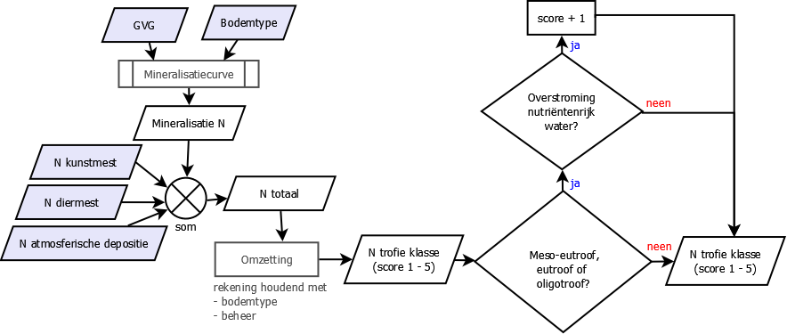

.. _nutrient_level:

####################################
Berekening trofie ``nutrient_level``
####################################

Output 
======

De trofie (``nutrient_level``) is de mate van voedselrijkdom van de bodem.
NICHE Vlaanderen genereert een vereenvoudigde kaart van de trofie ingedeeld in 5 klassen (veld ``code``):

.. csv-table:: Trofie klassen
  :header-rows: 1
  :file: ../niche_vlaanderen/system_tables/nutrient_level.csv
  
De betekenis van deze klassen wordt in  `Callebaut et al. 2007 <https://pureportal.inbo.be/portal/files/5370206/Callebaut_etal_2007_NicheVlaanderen.pdf>`_ nader toegelicht.

.. _nutrient_level_princ:

Principe
========

NICHE berekent de **stikstofbeschikbaarheid als maat voor de trofie van de standplaats** op basis van:

* het bodemtype
* de gemiddelde voorjaarsgrondwaterstanden (GVG)
* de bemesting met kunstmest
* de bemesting met diermest
* de atmosferische stikstofdepositie
* het beheer
* het al dan niet overstromen met nutriëntenrijk water

Eerst wordt de *jaarlijkse stikstofmineralisatie* bepaald aan de hand van het bodemtype en van de gemiddelde voorjaarsgrondwaterstanden.
De stikstofmineralisatie wordt afgeleid uit de volgende mineralisatiecurven:

.. image:: _static/png/nutrient_mineralcurve.png
   :width: 500px
   :height: 250px

De *totale hoeveelheid stikstof* wordt vervolgens berekend als de som van de mineralisatie, atmosferische depositie en bemesting.

Deze wordt omgezet in een *trofieklasse* rekening houdend met het bodemtype en het beheer. De gebruikte `omzettingstabel <https://github.com/inbo/niche_vlaanderen/blob/master/niche_vlaanderen/system_tables/lnk_soil_nutrient_level.csv>`_ hanteert volgende principes:

* de grenzen tussen de trofieklassen variëren naargelang het bodemtype;
* als een hoogfrequent beheer wordt toegepast, verschuiven de grenzen tussen de trofieklassen: een gegeven trofieklasse komt dan overeen met een hogere stikstofhoeveelheid (of met andere woorden: een bepaalde locatie kan meer stikstof tolereren vooraleer de biomassaproductie/trofiegraad toeneemt).

Op de locaties met oligotrofe, mesotrofe en meso-eutrofe condities wordt uiteindelijk nog rekening gehouden met de gevolgen van eventuele overstromingen:
indien er zich overstromingen met nutriëntenrijk water voordoen, wordt er in NICHE Vlaanderen aangenomen dat de nutriëntenrijkdom daardoor met een trofieklasse (extra) toeneemt.

.. _nutrient_level_input:

Invoergegevens
==============

 * :ref:`soil_code`
 * :ref:`msw`
 * :ref:`nitrogen_fertilizer`
 * :ref:`nitrogen_animal`
 * :ref:`nitrogen_atmospheric`
 * :ref:`management`
 * :ref:`inundation_nutrient`

Implementatie in het package ``niche_vlaanderen``
=================================================

De berekening gebeurt in volgende 4 stappen:

 * `Berekening stikstofmineralisatie`_
 * `Bepaling totale stikstof`_
 * :ref:`trofie_code`
 * `Invloed overstroming`_

.. topic:: Voorbeeld

  De berekening van de trofie wordt in de volgende paragrafen geïllustreerd aan de hand van volgende waarden:
  
   * GVG: 33 cm onder maaiveld
   * Bodemcode: L1 (humusarme leemgrond)
   * N atmosferiche depositie: 20 kg/ha/j
   * N kunstmest: 0 kg/ha
   * N diermest: 350 kg/ha
   * Beheer: begrazing (2) 
   * Overstroming met nutriëntenrijk water (1)

.. _stikstofmineralisatie:

Berekening stikstofmineralisatie
--------------------------------

De stikstofmineralisatie (`nitrogen_mineralisation`) wordt berekend aan de hand van volgende invoergegevens

* :ref:`msw`
* :ref:`soil_code`

in combinatie met de tabel `nitrogen_mineralisation <https://github.com/inbo/niche_vlaanderen/blob/master/niche_vlaanderen/system_tables/nitrogen_mineralisation.csv>`_.
Daar wordt de stikstofmineralisatie bepaald met de bodemcode en de min en max waarde voor de gemiddelde voorjaarsgrondwaterstanden.

.. topic:: Voorbeeld
  
  Voor een humusarme leembodem (bodemcode L1, bodemcijfercode 14) en een GVG van 33 cm onder maaiveld krijgen we de waarde: 75 kg N/ha
  
  =============== ======= ======= =======================
  soil_code       msw_min msw_max nitrogen_mineralisation
  --------------- ------- ------- -----------------------
  ...             ...     ...     ...
  --------------- ------- ------- -----------------------
  L1              25      30      67
  --------------- ------- ------- -----------------------
  L1              30      35       **75**
  --------------- ------- ------- -----------------------
  L1              35       40      83
  --------------- ------- ------- -----------------------
  ...             ...     ...     ...
  =============== ======= ======= =======================
  
Bij het gebruik van deze codetabel wordt de bovengrens van elke GVG-categorie meegenomen in de categorie, maar niet de ondergrens: een GVG van 35 cm onder maaiveld resulteert in een stikstofmineralisatie van 75 kg N/jaar terwijl een GVG van 30 cm onder maaiveld met een mineralisatie van 67 kg N/jaar overeenkomt.

Als reële getallen voor de GVG worden gebruikt worden de waarden afgerond op 2 decimalen, d.w.z. 30.005 zal 30.01 cm(> 30, mineralisatie 75 kg N/jaar) worden en 30.004 zal 30.00 cm (= 30, mineralisatie 67 kg N/jaar) worden.

Bepaling totale stikstof
------------------------

De totale stikstof (N_tot) wordt bepaald als de som van volgende stikstofbronnen:

* :ref:`stikstofmineralisatie` (vorige stap)
* :ref:`nitrogen_atmospheric` (input raster)
* :ref:`nitrogen_fertilizer` (input raster)
* :ref:`nitrogen_animal` (input raster)

.. topic:: Voorbeeld
  
  .. math:: N_{tot} &= N_{mineralisatie} + N_{Atm\_Deposit} + N_{Mest\_Kunst} + N_{Mest\_Dier} \\
                  &= (75 + 20 + 0 + 350) \\
                  &= 445 kg N/ha

.. _trofie_code:

Bepaling gecodeerde trofie
--------------------------

De totale stikstof wordt gecombineerd met het type beheer en het bodemtype om de gecodeerde trofie te berekenen.
Mogelijke waarden van beheer worden gegeven in de tabel `Management <https://github.com/inbo/niche_vlaanderen/blob/master/niche_vlaanderen/system_tables/management.csv>`_.

.. csv-table:: Management
  :header-rows: 1
  :file: ../niche_vlaanderen/system_tables/management.csv

De "invloed" (influence) die correspondeert met het gekozen management kan met het bodemtype en de totale stikstof gebruikt worden om in de tabel `lnk_soil_nutrient_level <https://github.com/inbo/niche_vlaanderen/blob/master/niche_vlaanderen/system_tables/lnk_soil_nutrient_level.csv>`_ de gecodeerde trofie te berekenen

.. topic:: Voorbeeld

  * Beheer = begrazing (code 2) dus invloed (inluence) = 0
  * Bodemtype = L1
  * N_tot = 445 kg N/ha
  
  ==================== ========= ================== ================== ===========  
  management_influence soil_code total_nitrogen_min total_nitrogen_max nutrient_level
  -------------------- --------- ------------------ ------------------ -----------
    ...                  ...       ...                ...                 ...
  -------------------- --------- ------------------ ------------------ -----------
  0                     L1        156               293                   3
  -------------------- --------- ------------------ ------------------ -----------
  0                     L1       293                400                   4
  -------------------- --------- ------------------ ------------------ -----------
  0                    L1        400                10000                 **5**
  -------------------- --------- ------------------ ------------------ -----------
  ...                  ...       ...                ...                 ...
  ==================== ========= ================== ================== ===========
  
  De gecodeerde trofie is dus 5, hypereutroof.
  
Bij het gebruik van deze codetabel wordt de bovengrens van elke categorie voor N_tot meegenomen in de categorie, maar niet de ondergrens: een totale hoeveelheid stikstof van 400 kg N/ha resulteert dus in eutrofe condities (code 4) terwijl een hoeveelheid stikstof van 293 kg N/ha met meso-eutrofe condities (code 3) overeenkomt.

Invloed overstroming
--------------------

De waarden voor trofie die in de vorige stap berekend werden worden met 1 verhoogd
indien er zich overstromingen voordoen én de trofie 3 of lager is.

.. topic:: Voorbeeld

  De oorspronkelijk gecodeerde trofie is 5, hypereutroof.
  Door invloed van overstroming blijft dit 5.
