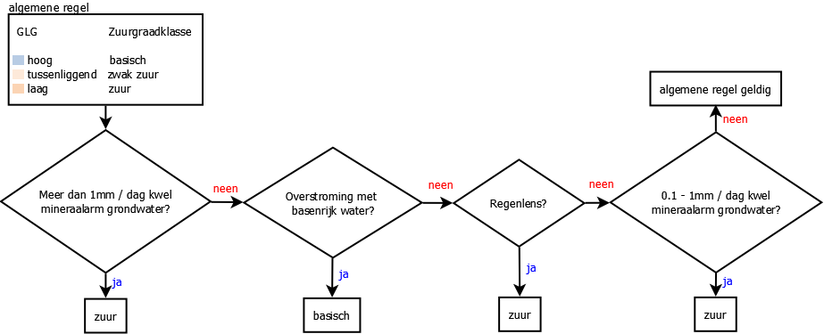

.. _acidity:

################################
Berekening zuurgraad ``acidity``
################################

Output 
=======

NICHE Vlaanderen genereert een vereenvoudigde kaart van de zuurgraad van de standplaats ingedeeld in de volgende klassen (veld ``acidity``):

.. csv-table:: Zuurgraadklassen in NICHE
  :header-rows: 1
  :file: ../niche_vlaanderen/system_tables/acidity.csv

.. _acidity_princ:

Principe
========

NICHE berekent de zuurgraad van de standplaats op basis van:

* het bodemtype;
* de gemiddelde laagste grondwaterstanden (GLG);
* het al dan niet overstromen met basenrijk water;
* de kwelflux;
* de mineraalrijkdom van het grondwater;
* de eventuele aanwezigheid van een regenwaterlens.

Als uitgangspunt geldt dat **bij hoge grondwaterstanden de standplaats beïnvloed wordt
door de kenmerken van het grondwater. Bij lage grondwaterstanden kan regenwater
infiltreren en wordt de standplaats zuurder**.

Als: 

* er kwel met mineraalarm grondwater is, 
* of als er overstroming met basenrijk water optreedt, 
* of als een regenlens aanwezig is,

... wordt de zuurgraad van de standplaats bijgestuurd als volgt:

De definitie van de hoge, tussenliggende en lage grondwaterstanden verschilt naargelang het bodemtype en wordt in onderstaande tabel weergegeven (zie ook `soil_mlw_class.csv <https://github.com/inbo/niche_vlaanderen/blob/master/niche_vlaanderen/system_tables/soil_mlw_class.csv>`_):

+-----------------+--------------------------------------------------------------+
|                 | GLG drempelwaarden per bodemgroep                            |
+-----------------+-------------------+---------------------+--------------------+
|                 | Bodemgroep 1      | Bodemgroep 2        | Bodemgroep 3       |
+-----------------+-------------------+---------------------+--------------------+
|                 | Minerale bodems   | Organische bodems   | Trilveen           |
+-----------------+-------------------+---------------------+--------------------+
| Grondwaterstand | K1, Z1, Z2, L1    | KV, LV, ZV, V       | P                  |
+=================+===================+=====================+====================+
| Hoog            | ]-999 – 80] cm    | ]-999 – 50] cm      | ]-999 – 30] cm     |
+-----------------+-------------------+---------------------+--------------------+
| Tussenliggend   | ]80 – 110]        | ]50 – 80]           | ]30 – 50]          |
+-----------------+-------------------+---------------------+--------------------+
| Laag            | ]110 – 9000]      | ]80 – 9000]         | ]50 – 9000]        |
+-----------------+-------------------+---------------------+--------------------+

*positieve GLG-waarden = onder maaiveld*

De beslisregels voor de zuurgraad kunnen ook worden samengevat als volgt:

.. image:: _static/png/acidity_table.png
     :scale: 100%

*B = neutraal/basisch, ZW = zwak zuur, Z = zuur*

.. _acidity_input:

Invoergegevens
==============

 * :ref:`soil_code`
 * :ref:`mlw`
 * :ref:`inundation_acidity`
 * :ref:`seepage`
 * :ref:`minerality`
 * :ref:`rainwater`

Implementatie in het package ``niche_vlaanderen``
=================================================

.. _soil_glg_class:

Bepaling bodem_GLG klasse
--------------------------

In eerste instantie worden de 3 bodemgroepen onderscheiden.

 * minerale bodems: Z1 of Z2 of L1 of K1 (of NG);
 * organische bodems: V of ZV of LV of KV;
 * trilveen: P.

Elke bodemcode wordt aan een bodemgroep gekoppeld in de tabel `soil_codes.csv <https://github.com/inbo/niche_vlaanderen/blob/master/niche_vlaanderen/system_tables/soil_codes.csv>`_.

Op basis van de bodemgroep en de GLG wordt de soil_mlw (bodem_GLG) klasse bepaald.
Dit gebeurt aan de hand van de tabel `soil_mlw_class.csv <https://github.com/inbo/niche_vlaanderen/blob/master/niche_vlaanderen/system_tables/soil_mlw_class.csv>`_.

.. topic:: Voorbeeld

  Voor een leembodem (bodemcode L1, bodemcijfercode 14) en een GLG van 50 cm onder maaiveld krijgen we:
  
  Humusarme leemgronden behoren tot de bodemgroep 1:
  
  .. csv-table:: bodemgroep op basis van bodemcode
    :header-rows: 1

    soil_code,short_code,beschrijving,soil_group
    14,L1,leem,**1**

  Kijken we verder in de tabel soil_mlw_class met deze bodemgroep (1) en de GLG van 50 cm onder maaiveld krijgen we een soil_mlw  (bodem_GLG) klasse van 1:

  .. csv-table:: soil_mlw_class op basis van bodemtype en GLG
    :header-rows: 1

    soil_group,mlw_min,mlw_max,soil_mlw_class
    ...,...,...,...
    1,-999,80,**1**
    1,80,110,2
    ...,...,...,...
    
Bij het gebruik van de codetabel soil_mlw_class wordt de bovengrens van elke GLG-categorie meegenomen in de categorie, maar niet de ondergrens: een GLG van 110 cm onder maaiveld resulteert voor minerale bodems in een soil_mlw (bodem_GLG) klasse van 2 terwijl een GLG van 80 cm onder maaiveld met een soil_mlw klasse van 1 overeenkomt.

Als reële getallen voor de GLG worden gebruikt worden de waarden afgerond op 2 decimalen, d.w.z. 80.005 zal 80.01 cm (> 80, soil_mlw klasse van 2) worden en 80.004 zal 80.00 cm (= 80, soil_mlw klasse van 1) worden.

Bepaling kwel klasse
--------------------------------

De reële waarden uit het grid :ref:`seepage` worden ingedeeld in 3 klassen, gaande van 1 (infiltratie) tot 3 (sterke kwel van meer dan 1 mm/dag)

De kwelflux wordt aan een kwel klasse gekoppeld in de tabel `seepage.csv <https://github.com/inbo/niche_vlaanderen/blob/master/niche_vlaanderen/system_tables/seepage.csv>`_.

.. topic:: Voorbeeld

  In het voorbeeld werd de waarde 0 mm/dag gebruikt. Dit wordt dus klasse 1 (infiltratie).
  
  .. csv-table:: kwel klasse
    :header-rows: 1

    seepage,seepage_min,seepage_max,description
    3,-999,-1,much seepage
    2,-1,-0.1,little seepage
     **1**,-0.1,999,infiltration
     
Bij het gebruik van deze tabel wordt de bovengrens van elke kwel-categorie meegenomen in de categorie, maar niet de ondergrens: een kwel van -1 mm/dag hoort dus bij de categorie "much seepage/veel kwel", bij -0.1 mm kwel per dag spreekt men van "little seepage/kwel".

Bepaling zuurcode
------------------

Aan de hand van de bodem_GLG klasse, de eventuele aanwezigheid van een regenwaterlens, de kwelflux en mineralenrijkdom van het grondwater en het al dan niet optreden van overstroming met basenrijk water wordt de zuurcode bepaald.
Dit gebeurt op basis van de tabel `lnk_acidity.csv <https://github.com/inbo/niche_vlaanderen/blob/master/niche_vlaanderen/system_tables/lnk_acidity.csv>`_.

.. topic:: Voorbeeld

  In de vorige stappen werden de bodem_GLG klasse en de kwel klasse bepaald op 1. Andere invoerwaarden zijn:
  
   * Regenlens = 1 (aanwezig)
   * Mineralenrijkdom = 1 (mineraalrijk grondwater)
   * Overstroming_zuurgraad = 1 (overstroming met basenrijk water)

   Zoeken we deze waarden op in de tabel lnk_acidity.csv krijgen we:

   .. csv-table:: lnk_acidity
     :header-rows: 1
    
     rainwater,mineral_richness,inundation,seepage,soil_mlw_class,acidity
     ...,...,...,...,...,...
     1,1,0,3,9,1
     1,1,1,1,1,**3**
     1,1,1,1,2,3
     ...,...,...,...,...,...

  De bepaalde zuurgraad is dus **3** (neutraal/basisch)
   
